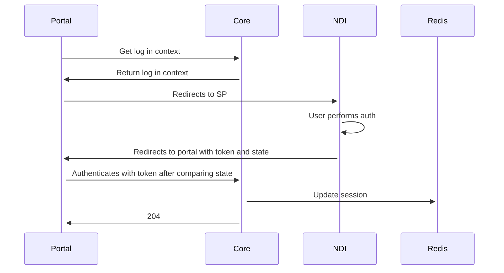

# Filesg

Do more with documents: Simplify Document Orchestration between Users and Agencies

1. Users and Agencies to share documents securely anytime and anywhere in a common platform
2. Enablement for authenticity verification of issued documents\* electronically. Supports PDF, images and Cert files (working with Opencerts)
3. Orchestrator of multiple parties digital signing of documents - in collaboration with Singpass Digital Signature

## Prequisite

- docker
- node (v16)
- recommended extensions for vscode
- db client (sequelPro, dbeaver, tablePlus etc...)
- redis client ([Redis Insight](https://redis.com/redis-enterprise/redis-insight/))
- aws cli
- nx cli (installed globally with `npm i -g nx`)

## How to get your local env up and running

1. installing all dependencies \
   Note: `--legacy-peer-deps` is required so that peer dependencies are installed manually as NPM 7 install peer dependencies automatically. \
   More details [here](https://stackoverflow.com/questions/66239691/what-does-npm-install-legacy-peer-deps-do-exactly-when-is-it-recommended-wh)

   ```bash
   npm i --legacy-peer-deps
   ```

2. ensure docker is running in your machine and then run start db in local

   ```bash
   npm run docker:start
   ```

3. Retriving environmental variables from AWS Parameter Store and Secret Manager \
   obtain your aws credentials from devops and ensure that it is exported in your terminal [https://docs.aws.amazon.com/sdk-for-java/v1/developer-guide/setup-credentials.html]

   ```bash
   export AWS_PROFILE=#your-profile
   npm run env:get:<env> <APP_NAME>

   # Example: Getting local env for service-core
   npm run env:get:local service-core
   ```

4. start dev environment

   ```bash
   npm start <project>

   # Example: Starting service-core
   npm start service-core

   # Example: Starting web-portal
   npm start web-portal
   ```

5. Installing new dependencies

   ```bash
   npm i <LIB_NAME> --legacy-peer-deps
   ```

6. Uninstalling existing dependencies

   ```bash
   npm uninstall <LIB_NAME> --legacy-peer-deps
   ```

## LocalStack
LocalStack is a fully functional local cloud stack that FileSG utilize to simulate AWS env locally. \
The main goal is allow local testing of file issuance flow.

Do note that the LocalStack setup is not persistent and all data will be erased once the docker container is stopped.

1. Start / Stop / Restart LocalStack

   ```bash
   npm run localstack:start
   npm run localstack:stop
   npm run localstack:restart
   ```

2. Toggling between clean and virus result for virus scanning

   ```bash
   # Update to virus result
   npm run localstack:virus-scan:virus

   # Reverting back to clean result
   npm run localstack:virus-scan:clean
   ```

3. View LocalStack logs

   ```bash
   # You can run without '-f' option if you do not want to follow the logs
   docker logs filesg-localstack  -f
   ```

4. View Virus Scan (mock) Lambda logs

   ```bash
   # You can run without '--follow' option if you do not want to follow the logs
   aws --endpoint=http://localhost:4566 logs tail '/aws/lambda/fsg-local-mock-virus-scan' --follow
   ```

5. Other commands
   LocalStack supports AWS cli, hence all the usual commands will apply.\
   The only difference is to always remember to add `--endpoint=http://localhost:4566` to the commands.

   For example,
   ```bash
      # Get SQS queue attributes
      aws --endpoint=http://localhost:4566 sqs get-queue-attributes --queue-url <QUEUE_URL> --attribute-names All

      # List S3 Objects
      aws --endpoint=http://localhost:4566 s3api list-objects --bucket <S3_BUCKET_NAME>
   ```

## CronJobs

1. Building cron job

   ```bash
   npm run build service-core -- --configuration=<CRONJOB_NAME>

   # Example: Buidling for expire-docs cronjob
   npm run build service-core -- --configuration=expire-docs
   ```

2. Running cron job locally

   ```bash
   npm run start:cron service-core -- --name=<CRONJOB_NAME>

   # Example: Running expiring-documents cronjob
   npm run start:cron service-core -- --name=expire-docs
   ```

## Using dev backend while developing frontend locally

   Edit the proxy.conf.json to the following

   ```json
      {
         "/api/core": {
            "target": "https://www.dev.file.gov.sg",
            "secure": false,
            "changeOrigin": true
         },
         "/api/transfer": {
            "target": "https://www.dev.file.gov.sg",
            "secure": false,
            "changeOrigin": true
         },
         "/assets": {
            "target": "https://www.dev.file.gov.sg",
            "secure": false,
            "changeOrigin": true
         },
            "/config": {
            "target": "https://www.dev.file.gov.sg",
            "secure": false,
            "changeOrigin": true
         }
      }
   ```

## How to analyze frontend bundle size
In the scenario where we need to reduce the frontend bundle size (to increase performance), we can use `webpack-bundle-analyzer` to do that.

1. Enable statsJson setting (build target) in project.json

   ```
      "statsJson": true
   ```

2. Build the app in production mode

   ```bash
      npm run build web-portal -- --configuration=production
   ```

3. Run the analyzer on the output stats.json, this will open the browser\
   ref: [How to Use Webpack Bundle Analyzer](https://akhromieiev.com/how-to-use-webpack-bundle-analyzer-in-angular-project/)

   ```bash
      npx webpack-bundle-analyzer dist/apps/web-portal/stats.json
   ```


## Commonly used NX cli commands

The full list of NX commands can be found in [NX](https://nx.dev/getting-started/intro) > API / Reference / CLI

- run\
  Runs an Architect target with an optional custom builder configuration defined in your project.

  ```bash
  nx run <target> [options]

  # Example
  # Run the build target for the myapp :
  nx run myapp:build

  # Run the build target for the myapp project with a production configuration:
  nx run myapp:build:production
  ```

- run-many\
  Run target for multiple listed projects\

  ```bash
  # Run test for proj1 and proj2
  nx run-many --target=test --projects=proj1,proj2

  # Example: Run test for all projects
  nx run-many --target=test --all

  # Example: Get local .env for all projects
  nx run-many --target=env:get:local --all
  ```

- serve\
  Builds and serves an application, rebuilding on file changes.\
  The serve command is a built-in alias to the run command.

  ```bash
  nx serve <project> [options]
  ```

- affected\
  Run target for affected project.\
  As NX keep a dependency graph in its cache, it is able to detect the affected projects between 2 commits and hence running the `target` for affected projects only.

  ```bash
  nx affected [options]

  # Run test for affected projects, comparing between master branch and current HEAD
  nx affected --target=test --base=master --head=HEAD

  # This is equivalent to the above command
  nx affected:test --base=master --head=HEAD
  ```

## Creating a new backend service

1. Run the following command in the root directory based on @nrwl/nest:applicaiton template or use VSCode NX extension \
   NOTE: backend service name shall start with `service-` prefix \

   ```bash
   npx nx generate @nrwl/nest:application <SERVICE_NAME> --no-interactive
   ```

2. Open the service's `project.json`

   - Add `targets.build.options.generatePackageJson` to `true` to generate a minimal package.json for deployment
   - Remove `targets.build.options.assets` field if there is no assets
   - Remove `targets.build.configurations.production.extractLicenses` as there is no need to extract licenses
   - Remove `targets.build.configurations.product.fileReplacements` as we are generating .env via other scripts
   - Add `targets.build.options.additionalEntryPoints` property to `build` target if it is a lambda as lambda do not use `main.ts` as entrypoint\
     NOTE: The name has to be the same as the app

3. Open the service's `tsconfig.app.json`

   - add `"**/*.mock.ts"` to `exclude` array so that build and run will exclude mock files

4. Open the service's `tsconfig.spec.json`

   - add `"**/*.mock.ts"` to `include` array so that Jest recognises the mock files

5. Add `backend` to the tags in project.json

## Creating a frontend application

1. Run the following command in the root directory based on @nrwl/react:application template or use VSCode NX extension
   NOTE: web application name shall start with `web-` prefix \

   ```bash
   npx nx generate @nrwl/react:application <APP_NAME> --compiler=swc --e2eTestRunner=none --no-interactive
   ```

2. Open the application's `project.json`

   - Remove `targets.build.defaultConfiguration` field
   - Update `targets.build.options.assets` field to what is neccessary
   - Update `targets.build.options.webpackConfig` to `webpack.react.config.js` which extended from `@nrwl/react/plugins/webpack`
   - Remove `targets.build.configurations.product.fileReplacements`
   - Remove `targets.build.configurations.production.extractLicenses` as there is no need to extract licenses
   - Add new target `generate-env` with the following configuration

   ```
    "generate-env": {
      "executor": "@nrwl/workspace:run-commands",
      "options": {
        "command": "react-env --dest src/public",
        "cwd": "apps/<APP_NAME>"
      }
    }
   ```

   - Add `targets.serve.options.proxyConfig` with value `proxy.conf.json`
   - Add `targets.server.options.port` with required value

3. Open the application's `tsconfig.json`

   - Remove `compilerOptions.noPropertyAccessFromIndexSignature`
   - Remove `compilerOptions.resolveJsonModule`
   - Add `compilerOptions.noImplicitReturns` with value `true`
   - Add `compilerOptions.noFallthroughCasesInSwitch` with value `true`

4. Update `jest.config.js`

5. Update `index.html`

6. Add `typings/asset.d.ts` and `typings/theme.d.ts`

7. Add `frontend` to the tags in project.json

## Creating a shared lib

1. Run the following command in the root directory @nrwl/js:library template.\
   NOTE: Library should be placed in `libs/<STACK>/` where `<STACK>` is the layer which it will be used

   ```bash
   npx nx generate @nrwl/js:library <LIB_NAME> --directory=backend --no-buildable --no-interactive
   ```

2. Update the library's `README.md` if required, else remove

3. Open ROOT `tsconfig.base.json`

   - Update `compilerOptions.paths` with the required alias, which is usually without the <STACK>.\
     For example, `@filesg/aws`, `@filesg/common`

4. Add `backend` or `frontend` or `common` to the tags in project.json

## Folders structure (for a single nestjs application)

1. assets

   - all the assets required for development

2. common (A list of common tools from NestJS to handle request, response, transformation and validation)

   1. filters
      - Access Execution context
      - Responsible for processing all unhandled exceptions across an application
      - When an exception is not handled by your application code, it is caught by this layer, which then automatically sends an appropriate user-friendly response.
      - Global exception is regitered here
   2. guards
      - Access Execution context
      - Only one single responsibility: A given _request_ will be handled or not
      - It checks permissions, roles, ACLs
      - Guard is not as dumb as middleware as it has access to the _ExecutionContext_ instance
   3. interceptors
      - Access Execution context
      - Have access to response/request before and after the route handler is called.
      - bind extra logic before / after method execution
      - transform the result returned from a function
      - transform the exception thrown from a function
      - extend the basic function behavior
      - completely override a function depending on specific conditions (e.g., for caching purposes)
   4. decorators
      - @decorator
      - Add metadata
   5. pipes
      - make use of class-transformer and class-validator
      - transform input data to the desired form (e.g., from string to integer)
      - evaluate input data and if valid, simply pass it through unchanged; otherwise, throw an exception when the data is incorrect

3. migration
   - migration scripts for database
   - configs for migration
4. dtos
   1. request
      - class-transformer
      - type a request body, query param
   2. response
      - plain javascript object
      - type response of a controller
   3. transformer
      - transform entities, query results to response
5. entities
   - It is a class that maps to a database table
   - Added to typeorm config
   - Primary key is auto increment, mainly use for foreign keys
   - Additional column uuid(unique) is for querying and transactions
6. mocks
   - mock test data
7. modules
   - This folder contains the main logic of the application
   - features folder consists of the different use cases of FileSG
   - setup folder consists of the one time setup modules which are used across different modules
8. typings
   - Consist of additional simple typings for the application
9. utils
   - Common utility functions or helpers for the application
10. main.ts
    - Setup modules, middleswares, AWS configuration, Swagger
    - The entry to the server

## Adding .env Variables

1. To add .env Variables to an app, open the app's `deployment/terraform/ssm-parameter.tf`
   - add the variable to `local.parameter_list` array

2. (For Lambda) Open `deployment/serverless/serverless.yml`
   - add the variable to `functions.postScan.environment`

## FAQ

### Why monorepo?

The reason to choosing monorepo is to streamline development process with the below benefits

- making it easier to share codes between applications, without the need to publish for every small changes or do `npm link` while developing
- easier code sharing will in turn reduce the amount of dulipcated codes
- keeping the dependencies version in sync (single package.json policy)
- centralising the build scripts/tools

### Which monorepo build system

[NX](https://nx.dev) is chosen as the build system as

- easy to use
- fleible and extensible with plugins

### What is (NestJS) Execution context?

Nest provides several utility classes that help make it easy to write applications that function across multiple application contexts.
These utilities provide information about the current execution context.
We can use Execution Context to obain: request, response, handler etc...

### What is the difference between (NestJS) interceptor and middlewares

Middleware is very flexible to register, but are more of a generic concept. While interceptor is closer to the route handlers compared to middleware.


### Authentication Flow (Singpass)
